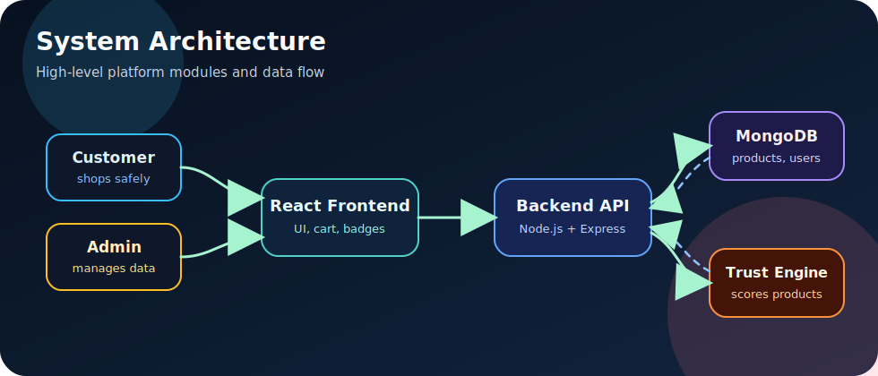
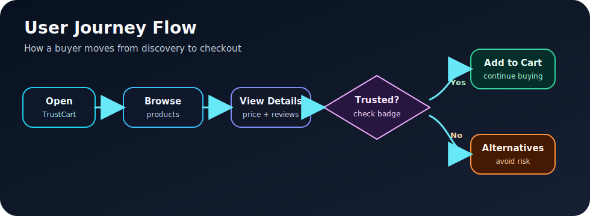
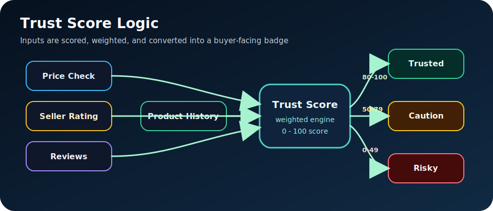
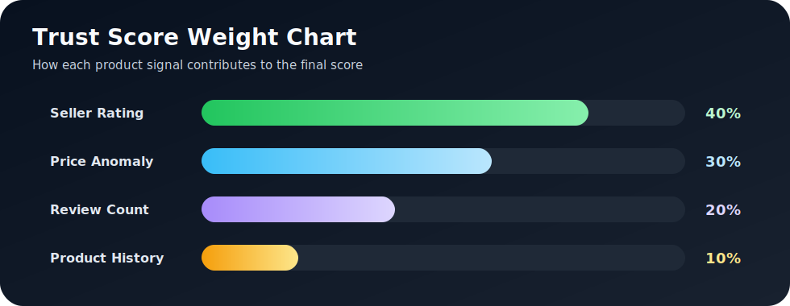
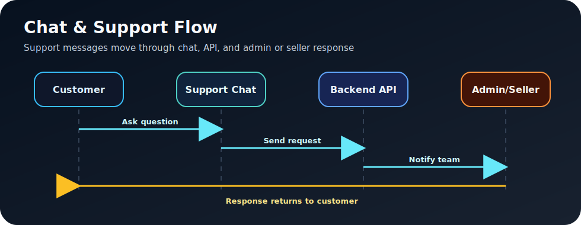
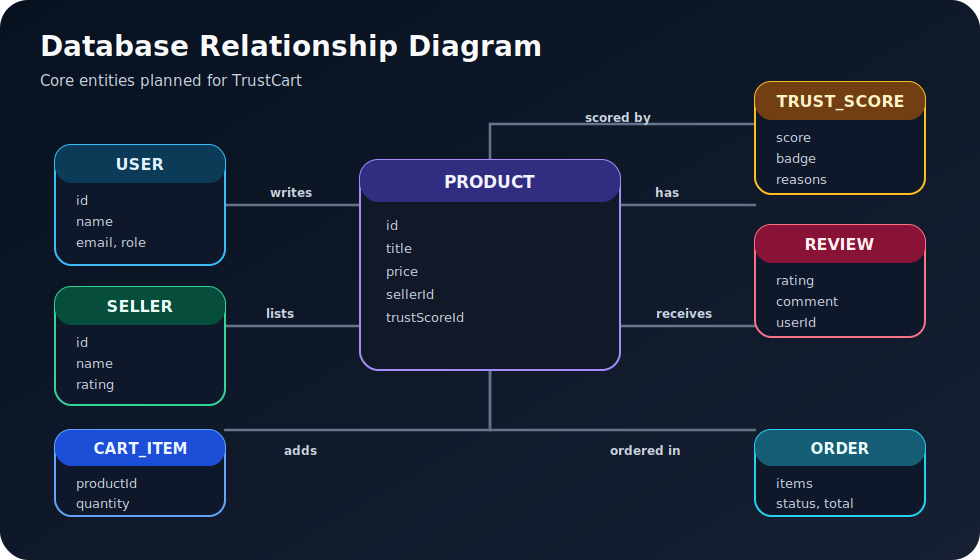

# 🛒 TrustCart – Smart & Secure E-commerce Platform

TrustCart is an innovative e-commerce platform that helps users make **safe and smart purchasing decisions** using a **Trust Score system**. The goal is to reduce fake product risk, highlight reliable sellers, and give customers clearer signals before they buy.

---

## 🚀 Overview

TrustCart combines a modern shopping experience with product verification logic. Each product can be evaluated using seller reputation, pricing behavior, review activity, and product history to generate a visible trust badge for buyers.

The current repository contains the React frontend prototype. Backend, database, admin dashboard, and trust score engine modules are part of the planned platform architecture.

---

## 🎯 Problem

Online marketplaces often contain:

- Fake products ❌
- Misleading sellers ❌
- Unreliable reviews ❌
- Suspicious pricing ❌
- Low transparency for buyers ❌

---

## 💡 Solution

TrustCart introduces a **Trust Score Algorithm** that evaluates products based on:

- Seller rating
- Price anomaly
- Review count
- Product history
- Customer feedback patterns

The final score is shown as a simple trust badge so users can quickly understand whether a product looks safe, risky, or suspicious.

---

## 🏗️ System Architecture



---

## 🔁 User Journey Flow



---

## 🧠 Trust Score Logic



---

## 📊 Trust Score Weight Chart



### Example Score Levels

| Trust Score | Badge | Meaning |
| --- | --- | --- |
| 80 - 100 | 🟢 Trusted | Product looks reliable |
| 50 - 79 | 🟡 Caution | Product needs review before buying |
| 0 - 49 | 🔴 Risky | Product may be fake or suspicious |

---

## 💬 Chat & Support Flow



---

## 🗃️ Database Relationship Diagram



---

## ⚙️ Tech Stack

| Layer | Technology |
| --- | --- |
| Frontend | React.js |
| Backend | Node.js + Express |
| Database | MongoDB |
| Styling | CSS |
| Testing | Testing Library |

---

## 🔥 Features

- 🛍️ Product listing
- 🛒 Cart system
- 🛡️ Fake product detection using Trust Score
- 🤖 Smart recommendations
- 📊 Admin dashboard
- 💬 Customer support chat
- 🏷️ Trust badges for products
- ⭐ Review and seller rating analysis

---

## 📂 Project Structure

```bash
TrustCart/
├── client/        # Frontend (React)
├── server/        # Backend (Node.js + Express) - planned
├── README.md
└── .gitignore
```

Current implementation:

```bash
client/
├── public/
├── src/
│   ├── App.js
│   ├── App.css
│   ├── index.js
│   └── index.css
├── package.json
└── package-lock.json
```

---

## 🧪 Run Locally

```bash
cd client
npm install
npm start
```

The frontend runs at:

```text
http://localhost:3000
```

---

## 📌 Status

🚧 In Development

Current progress:

- React frontend prototype created
- Product card UI added
- TrustCart platform architecture planned
- Backend and database modules pending

---

## 👨‍💻 Author

**Karman Singh Chandhok**
